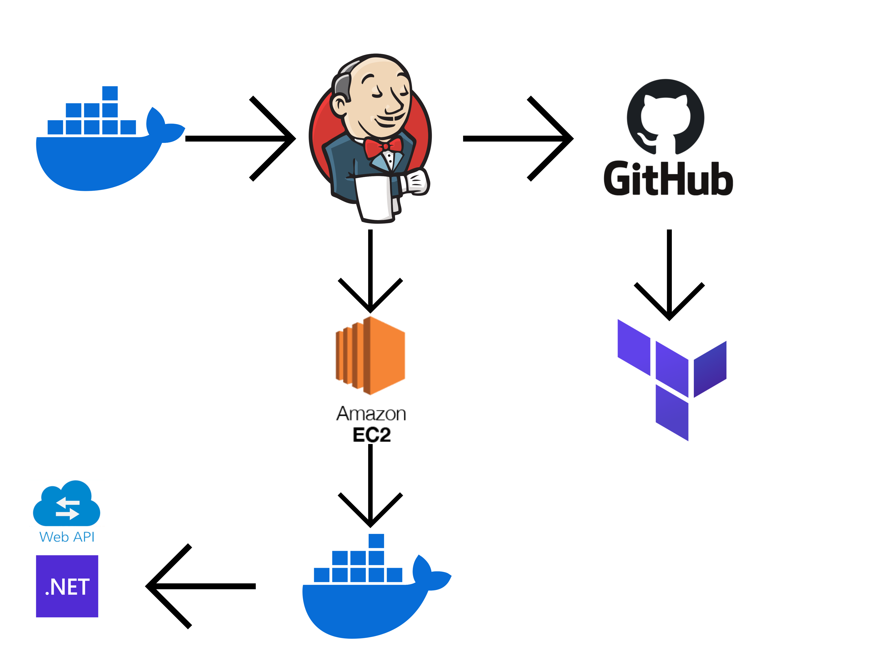

# Jenkins Terraform .NET WebApi projekt



## Projekt inicializálása
### Feltételek:
#### Docker, valamilyen IDE, AWS Account

### A Jenkins container létrehozása

```bash
docker build -t myimage -f Dockerfile .
docker run -d -p 8080:8080 -p 50000:50000 --name myjenkins myimage
docker logs myjenkins
```

#### Aztán localhost:8080 - ra ellátogatva, docker logs által megadott hashkódot kell majd használni az első belépéshez. Létre kell hozni egy alap felhasználót, majd installálni a szükséges pluginokat ([videó erről](https://youtu.be/Zdxko2bPAAw?t=341))

### Jenkins beüzemelése

#### A dashboardon -> Manage Jenkins -> Plugins -> Available Plugins -> Terraform és AWS Credentials plugin kell majd

#### Dashboard -> Manage Jenkins -> Manage Credentials -> Globális credentialt kell létrehozni, egyet a Githubnak és egyet az AWS-nek.

#### Dashboard -> Manage Jenkins -> Tools -> Az alján terraform, automatic installation

#### Dashboard -> New Item -> Pipeline (névnek valamit) -> Add meg a github repót (az enyém vagy ha magadnak csinálod sajátot), a pipeline scriptbe pedig másold be az én Jenkinsfileom (Fontos hogy a toolsnál azt a nevet add meg a terraformnak aminek elnevezted az előző lépésben)

## .Net Docker contanier (opcionális)

#### Használhatod az enyémet is amin rajta van az alap .NET-es WebApi template, ehhez:

```bash
docker pull inckrisz/dotnet-webapi:latest
```

### Ha saját magadnak akarod buildelni

```bash
docker build -t mydotnetimage -f Dockerfile-net .
```

### Teszteléshez:

```bash
docker run -d -p 5324:5324 --name mydotnet mydotnetimage
```

#### Majd látogass el a localhost:5324 -re, ott látnod kell a swagger UI-os WebApi-t.

#### Ezt a docker imaget így (vagy a saját változtatásoddal) feltöltheted DockerHub-ra vagy AWS ECR-be, én az előbbivel csináltam.

### Terraform szkript

#### a terraform/main.tf -ben van a szkript, használhatod ezt vagy írhatsz sajátot, pushold fel egy repositoryba (vagy használd az enyémet), ha megváltoztatod a github repót ne felejtsd el átírni a Jenkinsfileban

### Pipeline kipróbálása

#### Menj bele a létrehozott pipelineodba és buildelj egyet

#### Ha jól csináltad, akkor az Amazon EC2 Instances-nél meg kell jelennie egy instancenek, keresd ki az IP-jét majd menj az IP:5324/swagger címre. Ha látod az UI-t akkor minden sikeres.

#### Ha már nem kell az instance, akkor a builden belül a Console Outputnál kérni fog egy inputot a szkript, menj az Igenre ha törölni szeretnél mindent amit létrehoztál.


